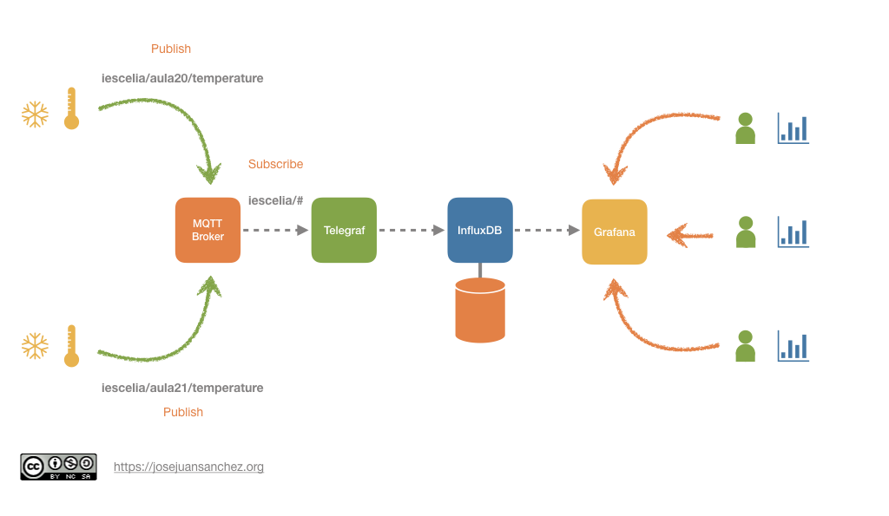

# IAW - Introducción a PHP
>IES Celia Viñas (Almería) - Curso 2020/2021   
>Módulo: IAW - Implantación de Aplicaciones Web   
>Ciclo: CFGS Administración de Sistemas Informáticos en Red 

# Descripción del proyecto

En cada aula del instituto vamos a tener un Wemos D1 mini, un [sensor de CO2](https://wiki.keyestudio.com/KS0457_keyestudio_CCS811_Carbon_Dioxide_Air_Quality_Sensor) y un [sensor de temperatura/humedad DHT11](https://learn.adafruit.com/dht/overview) que van a ir tomando medidas de forma constante y las van a ir publicando en un topic de un broker MQTT. Podríamos seguir la siguiente estructura de nombres para los topics del edificio:

```bash
iescelia/aula<número>/temperature
iescelia/aula<número>/humidity
iescelia/aula<número>/co2
```

Por ejemplo para el aula20 tendríamos los siguientes topics:

```bash
iescelia/aula20/temperature
iescelia/aula20/humidity
iescelia/aula20/co2
```

También existirá un agente de [Telegraf](https://www.influxdata.com/time-series-platform/telegraf/) que estará suscrito a los **topics** del [broker MQTT](https://mqtt.org/) donde se publican los valores recogidos por los sensores. El agente de [Telegraf](https://www.influxdata.com/time-series-platform/telegraf/) insertará los valores que recoge del [broker MQTT](https://mqtt.org/) en una base de datos [InfluxDB](https://www.influxdata.com/), que es un sistema gestor de bases de datos diseñado para almacenar series temporales de datos. Finalmente tendremos un servicio web [Grafana](https://grafana.com/) que nos permitirá visualizar los datos en un panel de control.

Para realizar el despliegue de los servicios de [MQTT](https://mqtt.org/), [Telegraf](https://www.influxdata.com/time-series-platform/telegraf/), [InfluxDB](https://www.influxdata.com/) y [Grafana](https://grafana.com/), vamos a utilizar [Docker Compose](https://docs.docker.com/compose/) y contenedores [Docker](https://www.docker.com/).

## Estructura


## REFERENCIAS
- [José Juan Sánchez IoT Dashboard](http://josejuansanchez.org/iot-dashboard/)