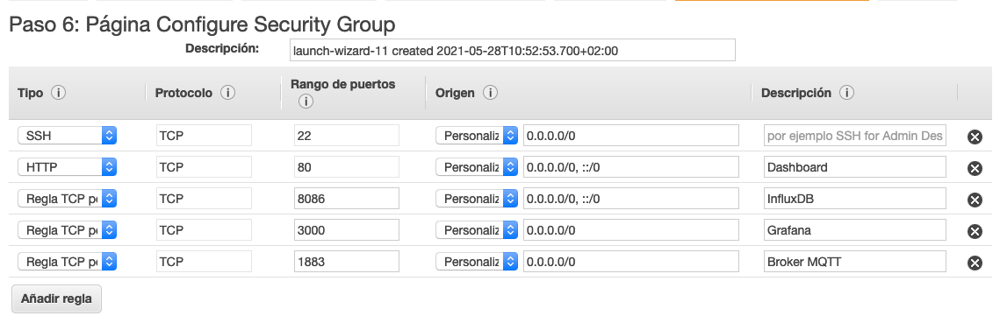
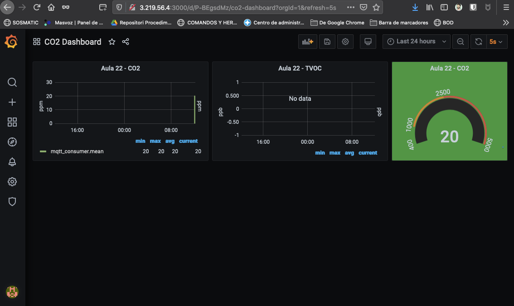

# IAW - IoT Dashboard - Sensores, MQTT, Telegraf, InfluxDB y Grafana 
>IES Celia Viñas (Almería) - Curso 2020/2021   
>Módulo: IAW - Implantación de Aplicaciones Web   
>Ciclo: CFGS Administración de Sistemas Informáticos en Red 

# Descripción del proyecto

En cada aula del instituto vamos a tener un [Wemos D1 mini](https://www.wemos.cc/en/latest/d1/d1_mini.html), un [sensor de CO2](https://wiki.keyestudio.com/KS0457_keyestudio_CCS811_Carbon_Dioxide_Air_Quality_Sensor) y un [sensor de temperatura/humedad DHT11](https://learn.adafruit.com/dht/overview) que van a ir tomando medidas de forma constante y las van a ir publicando en un topic de un broker MQTT. Podríamos seguir la siguiente estructura de nombres para los topics del edificio:

```bash
iescelia/aula<número>/temperature
iescelia/aula<número>/humidity
iescelia/aula<número>/co2
```

Por ejemplo para el aula20 tendríamos los siguientes topics:

```bash
iescelia/aula20/temperature
iescelia/aula20/humidity
iescelia/aula20/co2
```

También existirá un agente de [Telegraf](https://www.influxdata.com/time-series-platform/telegraf/) que estará suscrito a los **topics** del [broker MQTT](https://mqtt.org/) donde se publican los valores recogidos por los sensores. El agente de [Telegraf](https://www.influxdata.com/time-series-platform/telegraf/) insertará los valores que recoge del [broker MQTT](https://mqtt.org/) en una base de datos [InfluxDB](https://www.influxdata.com/), que es un sistema gestor de bases de datos diseñado para almacenar series temporales de datos. Finalmente tendremos un servicio web [Grafana](https://grafana.com/) que nos permitirá visualizar los datos en un panel de control.

Para realizar el despliegue de los servicios de [MQTT](https://mqtt.org/), [Telegraf](https://www.influxdata.com/time-series-platform/telegraf/), [InfluxDB](https://www.influxdata.com/) y [Grafana](https://grafana.com/), vamos a utilizar [Docker Compose](https://docs.docker.com/compose/) y contenedores [Docker](https://www.docker.com/).

## Estructura


## Configuración
Utilizaremos una instancia de [AWS EC2](https://aws.amazon.com/es/free/?all-free-tier.sort-by=item.additionalFields.SortRank&all-free-tier.sort-order=asc&awsf.Free%20Tier%20Categories=categories%23compute&trk=ps_a134p000006pgVlAAI&trkCampaign=acq_paid_search_brand&sc_channel=PS&sc_campaign=acquisition_FR&sc_publisher=Google&sc_category=Cloud%20Computing&sc_country=FR&sc_geo=EMEA&sc_outcome=acq&sc_detail=aws%20ec2&sc_content=EC2_e&sc_matchtype=e&sc_segment=496473794115&sc_medium=ACQ-P|PS-GO|Brand|Desktop|SU|Cloud%20Computing|EC2|FR|EN|Text&s_kwcid=AL!4422!3!496473794115!e!!g!!aws%20ec2&ef_id=EAIaIQobChMI1fPKn4Xs8AIVzIODBx10NwTzEAAYASAAEgJ_0vD_BwE:G:s&s_kwcid=AL!4422!3!496473794115!e!!g!!aws%20ec2&awsf.Free%20Tier%20Types=*all) de [Ubuntu Server](https://ubuntu.com/download/server) con 4GB de RAM.

Para los grupos de seguridad añadimos los siguientes: 


## Creación de archivos de configuración necesarios
Para ``mosquitto`` necesitamos que tenga un archivo de configuración con este contenido: 
```
listener 1883
allow_anonymous true
```
- Le indicamos que escuche en el puerto 1883 en todas las interfaces.
- Le permitimos a cualquiera que pueda leer la información sin identificarse.

Para ``telegraf`` :
```
[[inputs.mqtt_consumer]]
   servers = ["tcp://mosquitto:1883"] 

   topics = [
     "iescelia/#" 
   ]

  data_format = "value" 
  data_type = "float"
```
- Indicamos la URL del broker MQTT al que queremos conectarnos. En nuestro caso pondremos el nombre del servicio mosquitto que es como lo hemos definido en nuestro archivo docker-compose.yml.
- Indicamos los topics a los que queremos suscribirnos. El carácter # al final del topic iescelia/# indica que nos vamos a suscribir a cualquier topic que haya después de iescelia/.
- Indicamos cuál es el formato de los datos que vamos a recibir por MQTT. En este caso indicamos el formato value, porque en el mensaje MQTT sólo vamos a recibir un valor numérico.
- Indicamos el tipo de dato del valor numérico que vamos a recibir por MQTT. 

Extraemos el archivo de configuración de ``telegraf``:
```
docker run --rm telegraf telegraf config > telegraf.conf
```
#### PRUEBAS
Usamos de un cliente MQTT para publicar mensajes de prueba en el broker MQTT que acabamos de crear.

```
sudo docker run --init -it --rm efrecon/mqtt-client pub -h 3.219.56.4 -p 1883 -t "iescelia/aula22/co2" -m 10
```

- Utilizamos la imagen Docker efrecon/mqtt-client que contiene el cliente MQTT (mosquitto_pub) para publicar mensajes en un topic de un broker MQTT.
- Utilizamos el comando pub para publicar un mensaje en el broker MQTT.
- Con el parámetro -h indicamos el hosts (broker MQTT) con el que queremos conectarnos. En este ejemplo estamos utilizando el broker de prueba de test.mosquitto.org, pero tendremos que cambiar este broker por la dirección IP de nuestro broker MQTT.
- Con el parámetro -p indicamos el puerto, que por defecto, será el puerto 1883.
- Con el parámetro -t indicamos el topic que vamos a utilizar para publicar nuestro mensaje. En este ejemplo, estamos utilizando el topic iescelia/aula22/co2.
- Con el parámetro -m indicamos el contenido del mensaje que queremos publicar. En este ejemplo, estamos publicando el mensaje 10.

## Dashboard Grafana


## REFERENCIAS
- [José Juan Sánchez IoT Dashboard](http://josejuansanchez.org/iot-dashboard/)
- [Repositorio de Github - José Juan Sánchez](https://github.com/josejuansanchez/co2-celia)